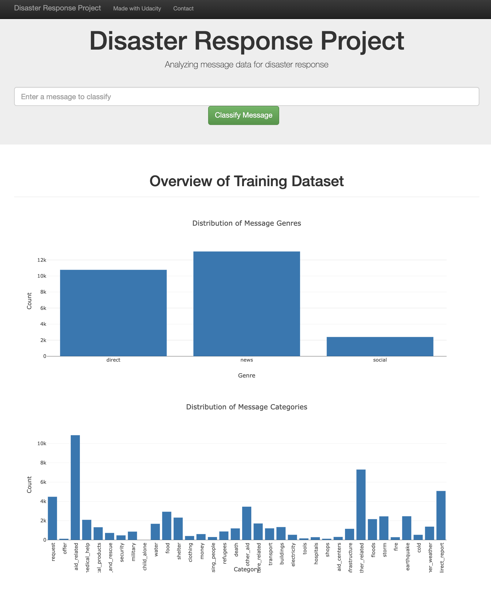
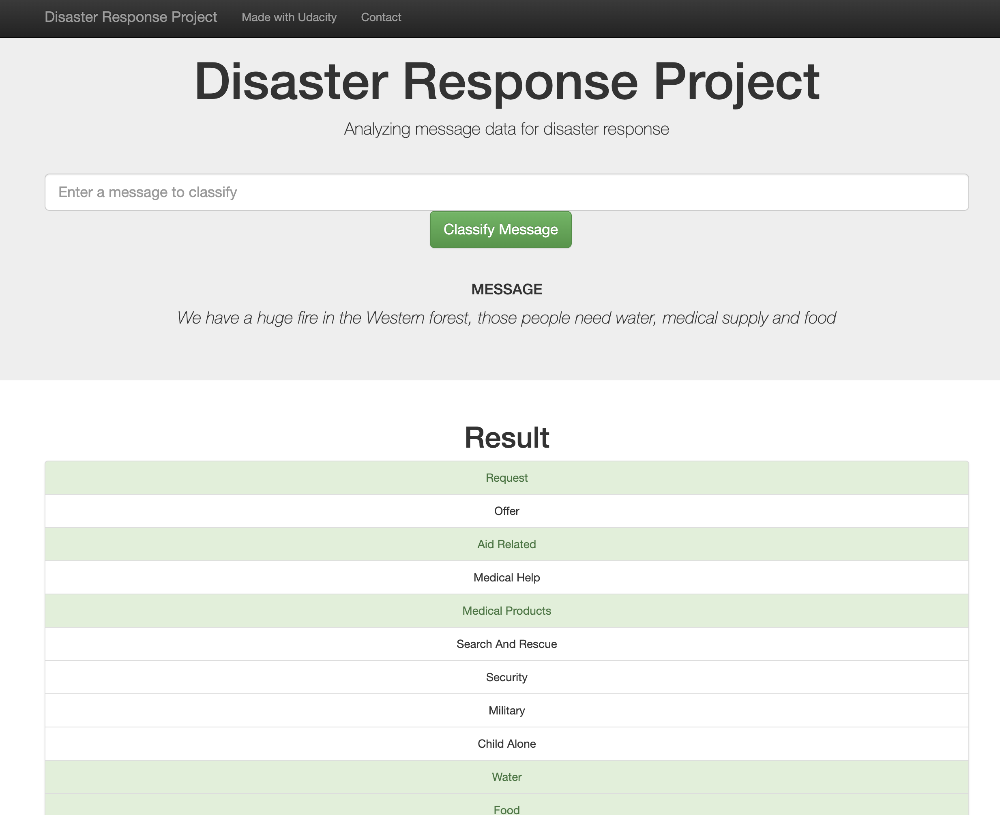

# Disaster Response Pipeline Project

## Table of Contents
1. [Motivation](#motivation)
2. [File Structure](#file_structure)
3. [Instructions](#instructions)
4. [Acknowledgements](#acknowledgements)
5. [Screenshots](#screenshots)
6. [Authors](#authors)

### Motivation
In this project, Udacity in collaboration with Figure Eight provides a data engineering project. The goal was to analyze disaster data from Figure Eight to build a model for an API that classifies disaster messages and use Flask to visualize the data.

### File Structure
    .
    ├── app     
    │   ├── run.py                           # Flask file that runs the app
    │   └── templates   
    │       ├── go.html                      # Classification result page of the web app
    │       └── master.html                  # Main page of the web app    
    ├── data                   
    │   ├── disaster_categories.csv          # Dataset including all the categories  
    │   ├── disaster_messages.csv            # Dataset including all the messages
    │   ├── process_data.py                  # Data cleaning script
    │   └── DisasterResponse.db              # SQL Database as output from data cleaning script
    ├── models
    │   ├── classifier.pkl                   # Trained ML model from train_classifier script saved as pickle file
    │   └── train_classifier.py              # Train ML model script         
    ├── screenshots
    │   ├── homepage.png                     # Screenshot of homepage
    │   └── sample_query.png                 # Screenshot of classified query (example)
    └── README.md

### Instructions:

1. Run the following commands in the project's root directory to set up your database and model.

    - To run ETL pipeline that cleans data and stores in database
        `python3 data/process_data.py data/disaster_messages.csv data/disaster_categories.csv data/DisasterResponse.db`
    - To run ML pipeline that trains classifier and saves
        `python3 models/train_classifier.py data/DisasterResponse.db models/classifier.pkl`

2. Run the following command in the app's directory to run your web app.
    `python3 run.py`

3. Go to http://0.0.0.0:3001/
Added another line to README.md

### Acknowledgements
- [Udacity](https://www.udacity.com/) for providing the collaboration efforts in the Data Science Nanodegree Program
- [Figure Eight](https://www.figure-eight.com/) for providing the messages dataset for such a meaningful project

### Screenshots:
1. Homepage displaying meta data of classifications

2. Example of classifying new message - typed in: We have a huge fire in the Western forest, those people need water, medical supply and food

### Authors
- [Minh Hoang Nguyen](https://github.com/justZen94)
